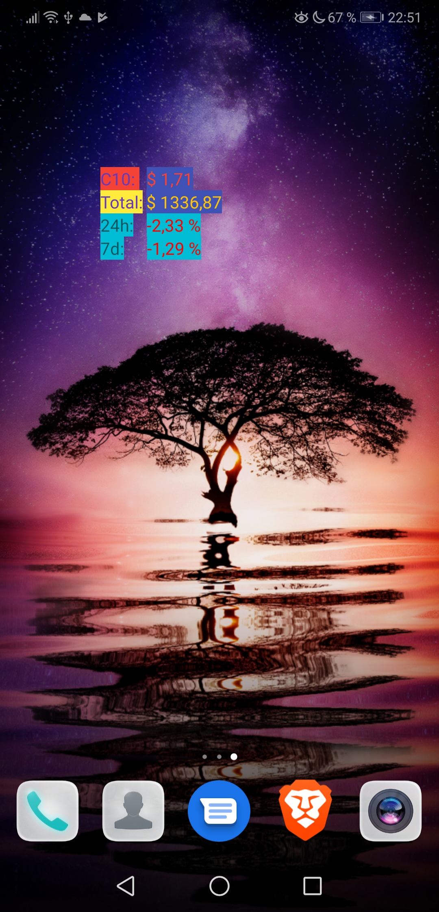

# C10NAV

{:height="50%" width="50%"}

C10 Ticker widget for android. Automatic refresh is not working currently.

Please open a new issue or PM me directly on discord if something is missing or if you find a bug.

Donations accepted: 0x6a05b9112a090D7438F07ead52185CdBdE7D06ED

## Instructions
1. Install [apk](app/build/outputs/apk/debug/c10-nav-ticker.apk)
2. Enter amount of holdings and press save
3. Add widget
4. Touch widget to update values
5. ???
6. Profit

## Wishlist

Sorted for priority

- Automatic updates
- 24h, 7d, 30d percentage changes
- C20 and IHF support

